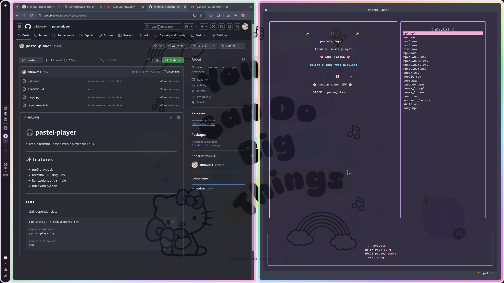

<div align="center">

# 🎧 pastel-player

### a pastel themed terminal music player for linux ✨



<br>


</div>

---

# 🌸 Features

- 🎵 MP3 + WAV playback
- 💖 pastel terminal UI
- ⌨ keyboard navigation
- 📂 automatic music scanning
- 🔀 random playback mode
- ⏯ pause / resume support
- 🎀 built using Textual
- ⚡ lightweight and fast

---

# 🖥 Supported Operating Systems

| OS | Supported |
|----|-----------|
| Linux | ✅ |
| Windows | ❌ |
| macOS | ⚠ untested |

> made mainly for Linux desktop environments like Hyprland, KDE, GNOME, etc.

---

# 🚀 Installation Guide

## 1 — Clone the repository

```bash
git clone https://github.com/oliclove14/pastel-player.git
cd pastel-player
```

---

## 2 — Create virtual environment

### bash / zsh

```bash
python -m venv venv
source venv/bin/activate
```

### fish shell

```fish
python -m venv venv
source venv/bin/activate.fish
```

---

## 3 — Install dependencies

```bash
pip install -r requirements.txt
```

---

## 4 — Install mpv

### Arch / CachyOS

```bash
sudo pacman -S mpv
```

### Ubuntu / Debian

```bash
sudo apt install mpv
```

### Fedora

```bash
sudo dnf install mpv
```

---

## 5 — Run the app

```bash
python app.py
```

---

# 🎮 Controls

| Key | Action |
|-----|--------|
| ↑ ↓ | Navigate playlist |
| ENTER | Play selected song |
| SPACE | Pause / Resume |
| n | Next song |
| p | Previous song |
| r | Toggle random mode |
| q | Quit |

---

# 📂 Audio Support

Supported formats:

- `.mp3`
- `.wav`

The player automatically scans your home directory for supported audio files.

---

# 💖 Screenshots

<div align="center">


</div>

---

# 🛠 Built With

- Python
- Textual
- mpv
- Rich

---

<div align="center">

### ✨ enjoy the vibes and your music ✨

</div>
